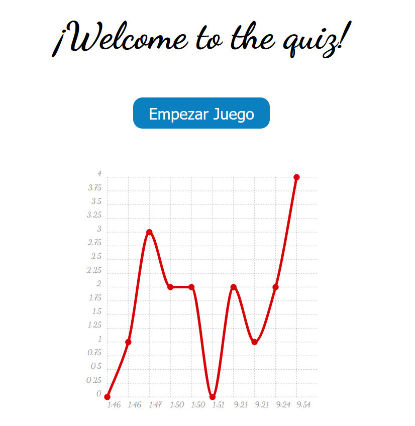

# Quiz

_Mi aplicación web simulando un Quiz donde se pueden contestar a unas preguntas que se muestran dinamicamente, además puedes guardar tus resultados y mostrarlos en gráficas_

## Que he utilizado en este proyecto? 🔧

- Html
- Css
- Javascript
  
> Se han implementado los siguientes recursos de Javascript
>   - Una libreria para poder pintar gráficas (Chartist)
>   - Los resultados se guardan del lado del cliente utilizando LocalStorage
>   - Utilización de módulos para separar el código en distintos fragmentos

## Preview 🚀

 

---
Hecho por [Germán Fernández](https://github.com/GeerDev) 😊 